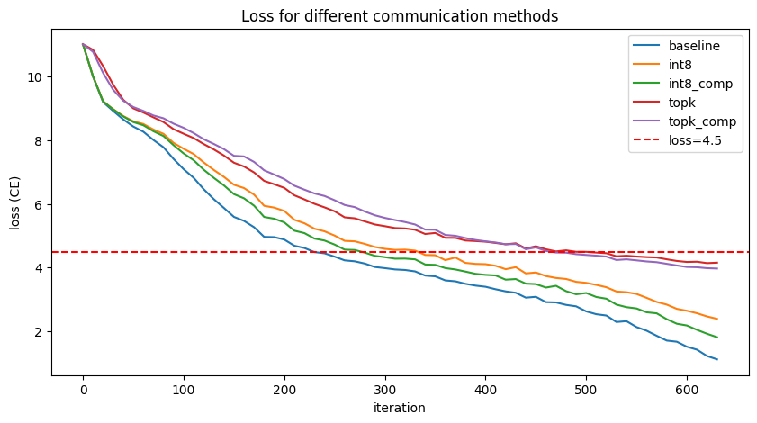

# Development and Study of Error Compensation Methods for Gradient Compression in Distributed Training of Large Language Models

## Repository Structure

```
<root>
├── data/         - data for LLM trining
├── logs/         - training logs
├── methods/
│   ├── int8_errcomp.py - quantzation with error compensation
│   ├── int8.py         - quantzation
│   ├── topk_errcomp.py - sparsification with error compensation
│   ├── topk.py         - sparsification
│   └── utils.py
├── kill.sh       - stop all training processes
├── logs.ipynb    - visualization
├── model.py      - GPT-2
├── README.md
├── run1.sh       - run training process on host-1
├── run2.sh       - run training process on host-2
└── train.py      - training loop
```

## Overview

This project investigates communication-efficient distributed training techniques for deep neural networks. The primary focus is on reducing the communication overhead during gradient synchronization in distributed data-parallel (DDP) and DeepSpeed-based training setups.

The study evaluates multiple gradient compression strategies and compares their impact on training convergence, communication cost, and overall system efficiency.

## Methods

### 1. Baseline (Full Precision Training)

Standard distributed training without any gradient compression is used as a reference. Gradients are synchronized across workers in full precision.

### 2. INT8 Quantization

Gradients are quantized to 8-bit integers before communication. This reduces bandwidth usage by lowering the precision of transmitted data.

### 3. INT8 Quantization with Error Compensation

An enhanced version of INT8 quantization that incorporates error feedback. The quantization error from previous iterations is accumulated and added back to future gradients before compression, improving convergence stability.

### 4. Top-K Sparsification

Only the top-K largest magnitude gradient elements are selected and transmitted. The remaining elements are discarded, significantly reducing communication volume.

### 5. Top-K Sparsification with Error Compensation

Combines sparsification with error feedback. The dropped gradient components are accumulated locally and reintroduced in subsequent iterations to mitigate information loss.

## Communication Measurement

For each method, the effective size of transmitted gradients is tracked. The following factors are considered:

* Data precision (e.g., float32 vs int8)
* Number of transmitted elements
* Metadata overhead (e.g., indices for sparse tensors)

This enables a fair comparison of communication efficiency across methods.

## Evaluation Metrics

The following metrics are used to evaluate performance:

* Convergence behavior (loss curves)
* Communication reduction ratio
* Speedup relative to baseline
* Recovery rate (ability to match baseline convergence)

## Key Findings

* INT8 quantization with error compensation demonstrates strong recovery and speedup characteristics.
* Pure INT8 quantization provides communication reduction but may affect convergence quality.
* Top-K sparsification achieves high compression rates but may degrade convergence without compensation.
* Top-K with error compensation improves stability but shows limited gains in recovery and speedup compared to INT8-based methods.

## Visualization



