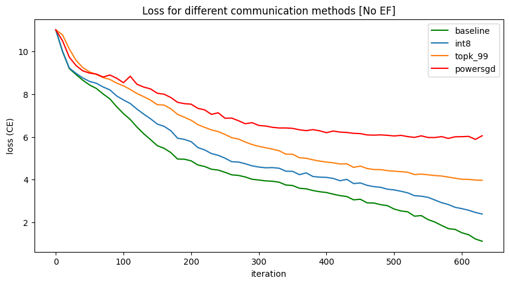
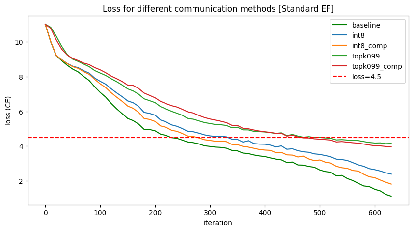
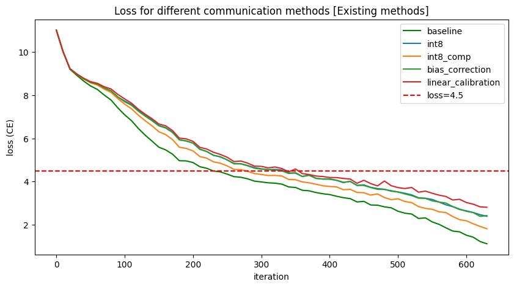
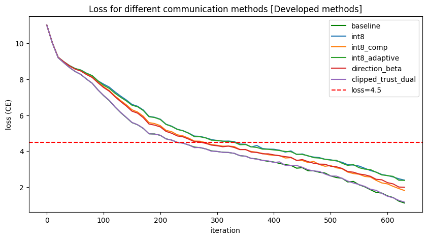
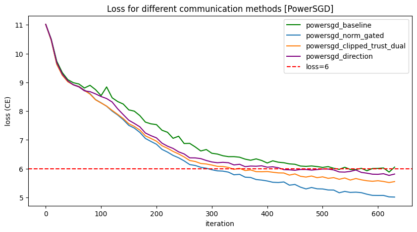
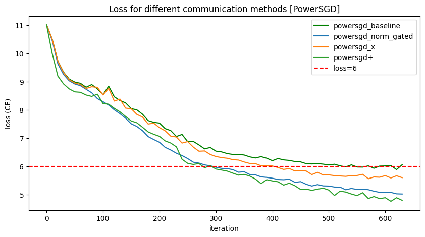
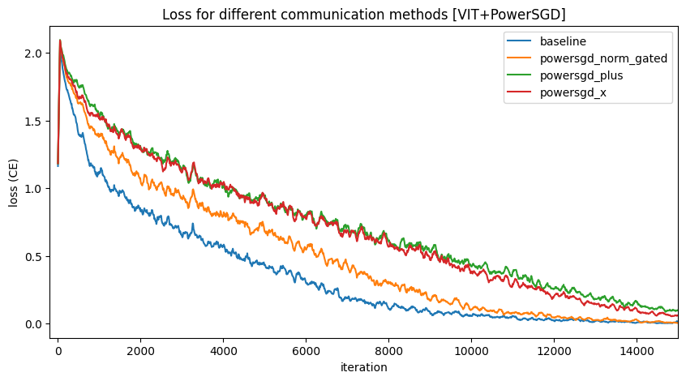

# Development and Study of Error Compensation Methods for Gradient Compression in Distributed Training of Large Language Models

## Overview

This repository contains the implementation and evaluation of gradient compression and error compensation methods for distributed neural network training using Fully Sharded Data Parallel (FSDP).

The main goal of this work is to investigate how different error-feedback mechanisms affect convergence quality when communication-efficient gradient compression techniques are applied. Several existing approaches were reproduced and compared with newly developed methods designed to improve training stability and reduce the optimization gap caused by compression.

Experiments were conducted on:

GPT-2 language model
ViT-Tiny image classification model

using multiple gradient compression techniques and a wide range of error compensation strategies.

## Repository Structure

```
<root>
├── data/         - data for models trining
├── gpt2/         - GPT2 model
├── logs/         - training logs
├── methods/      - implementations of all investigated methods
├── vit/          - ViT model
├── kill.sh       - stop all training processes
├── logs.ipynb    - visualization
└── README.md
```

## Gradient Compression Methods

The repository evaluates several communication-efficient gradient compression techniques.

### INT8 Quantization

Gradients are quantized from floating-point representation to 8-bit integers before communication. This significantly reduces message size while introducing quantization error

### Top-k Sparsification

Only the largest gradient values are transmitted while the remaining elements are omitted.

### PowerSGD

Gradients are approximated using a low-rank matrix factorization before communication.

## Evaluation Metrics

The following metrics are used to evaluate performance:

* Convergence behavior (loss curves)
* Communication reduction ratio
* Speedup relative to baseline
* Recovery rate (ability to match baseline convergence)

## Experiments

### Experiment 1 — Compression Methods Without Error Compensation

The first experiment evaluates the impact of gradient compression alone.

Compared methods:
- FSDP Baseline
- INT8 Quantization
- Top-k Sparsification (99%)
- PowerSGD (Rank 2)



## Experiment 2 — Standard Error Feedback

The second experiment evaluates the classical residual accumulation mechanism commonly used with compressed communication.

Compared methods:
- FSDP Baseline
- INT8
- INT8 + Error Feedback
- Top-k
- Top-k + Error Feedback


## Experiment 3 — Existing Error Compensation Techniques

This experiment compares several simple correction strategies built on top of INT8 compression.

Compared methods:
- FSDP Baseline
- INT8
- Standard Error Feedback
- Bias Correction
- Linear Calibration



## Experiment 4 — Proposed Error Compensation Methods

This experiment evaluates the methods developed during this work.

Compared methods:
- FSDP Baseline
- INT8
- Standard Error Feedback
- Adaptive Error Feedback
- Direction-Beta Compensation
- Clipped Trust Dual Memory



## Experiment 5 — PowerSGD with Advanced Error Compensation

This experiment evaluates the proposed methods when combined with low-rank gradient compression.

Compared methods:
- PowerSGD Rank-2 (standard implementation)
- Norm-Gated Compensation
- Clipped Trust Dual Memory
- Direction Compensation



## Experiment 6 — Comparison with Methods from Literature

The final GPT-2 experiment compares the developed approaches against methods proposed in published research.

Compared methods:
- PowerSGD Rank-2
- Norm-Gated Compensation
- ErrorCompensatedX
- PowerSGD+



## Experiment 7 — ViT-Tiny Training

To verify that the observed behavior generalizes beyond language models, the most promising methods were additionally evaluated on ViT-Tiny trained on CIFAR-10.

Compared methods:
- FSDP Baseline
- PowerSGD + Norm-Gated
- PowerSGD+
- ErrorCompensatedX

## Quantitative Results

The following table summarizes the key metrics used throughout the study.
